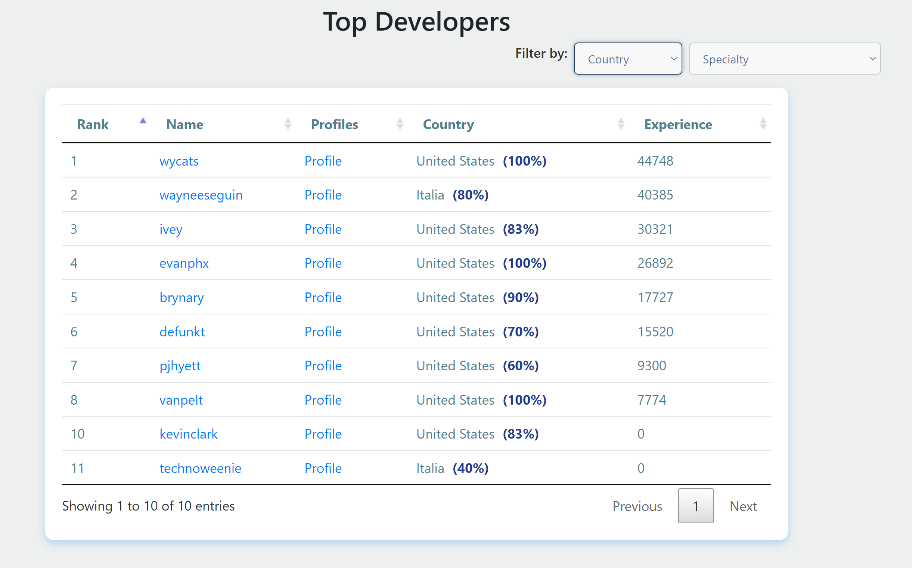

# 环境
* Spark
* Pyspark
* HDFS
* PostgreSQL

# 项目结构
```
init.sh - 初始化脚本，初始化HDFS的数据文件结构和PostgreSql的schema
init_db.sh - 初始化数据库
init_hdfs.sh - 初始化HDFS
leaderboard.html - 前端界面
pagerank.py - 算法脚本
pagerank.sh - 运行算法脚本
schema.sql - 数据库的schema
server.py - 后端API服务器
```
# 怎么使用
安装好需要的环境。

1. 添加环境变量`.env`
```
DB_HOST=''
DB_DATABASE=''
DB_USER=''
DB_PASSWORD=''
GITHUB_TOKEN=token "your token"
USER_AGENT=''
OPENAI_API_KEY=''
```
这些环境变量必须添加

2. HDFS的路径
`fetch.py`和`pagerank.py`需要知道HDFS的数据储存路径和获取路径。同时还需要知道HDFS的端口在`pagerank.py`,默认是9000.


## 使用
1. init.sh 初始化HDFS和数据库
2. 自动获取数据，运行`fetch.py`
3. 可以手动更新开发者分数通过运行`pagerank.py`或者等`fetch.py`自动更新
4. 打开后端服务器`server.py`
5. 使用前端`leaderboard.html`

# 整体结构
## 储存
* 使用HDFS来储存节点和边的计算需要的数据
* 使用PostgreSQL来储存分数和用户信息来加速查询
## 更新
* `fetch.py`获取数据先更新到PostgreSQL,然后数据清洗之后放到HDFS来准备计算
* `Pagerank.py`更新了分数更新到PostgreSQL
## 展示
* `server.py`后端服务器通过PostgreSQL获取数据，然后发送给前端

# 开发者的技术能力进行评级算法
建立在PageRank算法来实现的。节点是开发者和项目。然后边有两种类型，一种是开发者到项目，另外一种是项目到开发者。算法数据主要基于最近的PR提交。

开发者到项目的边代表的是开发者对这个项目的投入程度所以分数会由开发者流向项目来加大这个项目的影响力，权重由最近PR提交记录来决定，总体而言就是最近一段时间如果对这个项目的pr多而且代码提交量多说明投入程度高所以权重会大。

项目到开发者的边权重代表的是这个开发者对这个项目的贡献程度，如果一个开发者贡献程度高，项目会对这个开发者给予跟大的边占比。边占比的公式是`importance` * `投入程度`，这个`immportance`是由`start`和 `watch`决定的。

# 算法的运行
`fetch.py`会定时更新数据同时清洗数据到hdfs里面储存。然后`pagerank.sh`脚本会运行`pagerank.py`来利用`spark`来进行算法运行，结果在保存回PostgreSql。

# 前端


## 开发者用户整理
